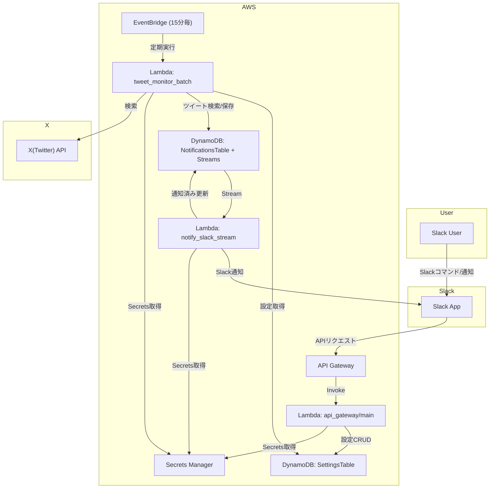

# tweet-watcher

このプロジェクトは AWS SAM を用いたサーバーレスアプリケーションです。

## 構成

- Lambda (API Gateway, EventBridge, DynamoDB Streams)
- DynamoDB (Settings, Notifications, XCredentialSettings)
- Slack 連携
- X（Twitter）API 連携
- Secrets Manager（Slack 用シークレット管理）

## デプロイ・開発フロー

### 1. Secrets Manager のセットアップ

まずは `scripts/setup_secrets.sh` を実行し、Slack のシークレットを登録してください。

```sh
bash scripts/setup_secrets.sh
```

- 対話形式で Slack Bot Token 等を入力
- 既存のシークレットがある場合は上書き確認プロンプトが表示されます

### 2. SAM ビルド・デプロイ

#### Makefile 利用例

```sh
make build   # sam build
make deploy  # sam deploy
```

#### 直接コマンド例

```sh
sam build
sam deploy --guided
```

#### 推奨: Secrets 連携デプロイスクリプト利用

```sh
bash scripts/deploy_with_secrets.sh --guided
```

- Secrets Manager から Slack のシークレットを自動取得し、sam deploy 時に必要な環境変数を一括で渡します
- 追加の sam deploy 引数もそのまま渡せます

#### 手動で環境変数をセットする場合

```sh
export SLACK_SIGNING_SECRET=... # 事前にSecrets Manager等から取得
export SLACK_BOT_TOKEN=...
sam build
sam deploy --parameter-overrides \
  SLACK_SIGNING_SECRET=$SLACK_SIGNING_SECRET \
  SLACK_BOT_TOKEN=$SLACK_BOT_TOKEN
```

- `samconfig.toml` でデプロイ先やパラメータを管理できます
- 必要に応じて `AWS_PROFILE` や `AWS_REGION` を指定してください

### 3. Lambda での Secrets 利用

- Lambda 関数は Secrets Manager から Slack API キー等を取得して動作します
- X（Twitter）API 認証情報は DynamoDB（XCredentialSettingsRepository）経由で管理され、Lambda 等の環境変数で直接指定する必要はありません
- template.yaml で Secrets Manager へのアクセス権限が付与されていることを確認してください

---

## システム構成図



---

## その他

- 詳細な API 仕様や設計方針は各種ドキュメント・コード内コメントを参照してください。
